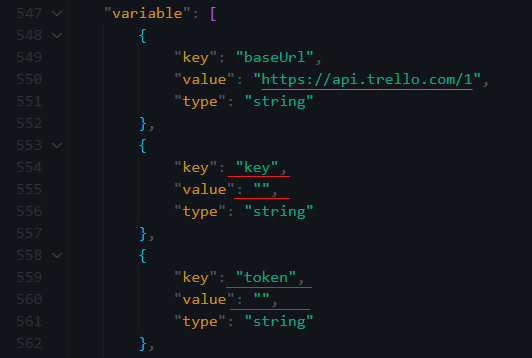
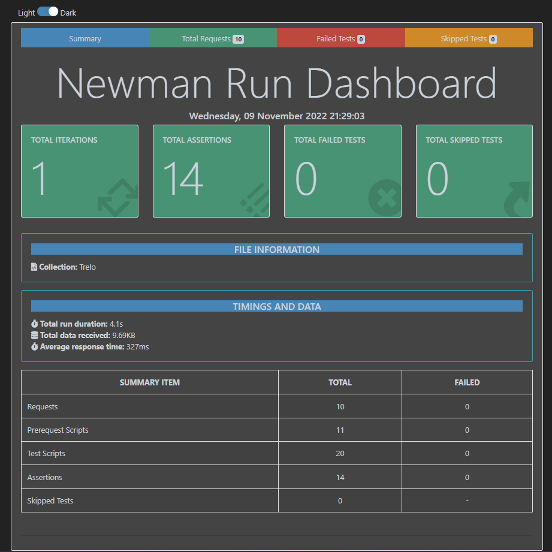

# Trello-API-test

[API Methods](https://developer.atlassian.com/cloud/trello/rest/api-group-actions/)

## Instalation

### Import collection in JSON to Postman

- Enter your token and key in collection variables

### Running collections on the command line with Newman and generate HTML Report

- Download and install the Node.js from [here](https://nodejs.org/en/)
- Install Newman, run in cmd:
```
npm install -g newman
```
- Install Newman Reporter HTMLExtra
```
npm install -g newman-reporter-htmlextra
```
- Download collection file from this repo
- Enter your token and API key in the code snippet below:


- Go to the folder where you have the collection in json, and run:
```
newman run Trello.postman_collection.json -r htmlextra,cli
```
- Above command will run tests in cmd and generate HTML Report e.g.


## Methods

- [Create a board (POST)](https://developer.atlassian.com/cloud/trello/rest/api-group-boards/#api-boards-post)

- [Get my boards (GET)](https://developer.atlassian.com/cloud/trello/rest/api-group-members/#api-members-id-boards-get)

- [Create a new list (POST)](https://developer.atlassian.com/cloud/trello/rest/api-group-boards/#api-boards-id-lists-post)

- [Get lists from board (GET)](https://developer.atlassian.com/cloud/trello/rest/api-group-boards/#api-boards-id-lists-get)

- [Update List (PUT)](https://developer.atlassian.com/cloud/trello/rest/api-group-lists/#api-lists-id-put)

- [Create a card (POST)](https://developer.atlassian.com/cloud/trello/rest/api-group-cards/#api-cards-post)

- [Get cards from board (GET)](https://developer.atlassian.com/cloud/trello/rest/api-group-boards/#api-boards-id-cards-get)

- [Update a card (PUT)](https://developer.atlassian.com/cloud/trello/rest/api-group-cards/#api-cards-id-put)

- [Delete a card (DEL)](https://developer.atlassian.com/cloud/trello/rest/api-group-cards/#api-cards-id-delete)

- [Delete a board (DEL)](https://developer.atlassian.com/cloud/trello/rest/api-group-boards/#api-boards-id-delete)
